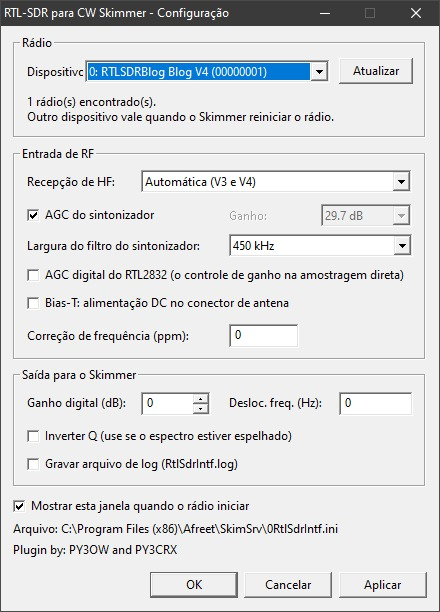

# RtlSdrIntf (RTL-SDR)

*English | [Português (Brasil)](README-RTLSDR.pt-BR.md)* · [Back to the main README](README.md)

Interface DLL that lets you use an **RTL-SDR** dongle, including the **RTL-SDR Blog V3 and V4**, with **Skimmer Server** and **RTTY Skimmer Server**. CW Skimmer is not supported.

> **Status:** tested only with a simulated driver. It has not been tried with a real dongle yet.

## What you need

- `bin/RtlSdrIntf.dll`. The driver (the RTL-SDR Blog fork of librtlsdr) and libusb are built in, so no other DLL is needed.
- The **WinUSB driver** installed for the dongle with [Zadig](https://zadig.akeo.ie/), the same setup SDR# uses: pick "Bulk-In, Interface (Interface 0)" and install WinUSB.
- No other program using the dongle at the same time.

## Installation

- **Skimmer Server / RTTY Skimmer Server:** copy `RtlSdrIntf.dll` (and optionally `RtlSdrIntf.ini`) to the program folder. The radio shows up in the list as **RTL-SDR**. One receiver only, that is, one band.
- **Together with the Airspy DLL:** the programs load all the DLLs in the folder at the same time, so with `AirspyHfIntf.dll` there too both radios show up in the list and you pick the one whose hardware is connected. No renaming is needed. See [Both DLLs in the same folder](README.md#both-dlls-in-the-same-folder).
- **CW Skimmer:** not supported. It cannot load the DLL, and renaming it does not help, as explained in the [main README](README.md#cw-skimmer).

## HF reception

| Dongle | "Automatic" does this | Notes |
|---|---|---|
| RTL-SDR Blog **V3** | Direct sampling on the Q branch below 24 MHz, tuner above | No setting needed |
| RTL-SDR Blog **V4** | Built-in upconverter below 28.8 MHz, tuner above | No setting needed |
| Generic dongle with an external upconverter | Tuner | Set `FreqOffsetHz` to the upconverter's oscillator, for example 125000000 |
| Generic dongle modified for direct sampling | — | Choose "Direct sampling, I branch" or "Q branch", whichever was wired |

In direct sampling the tuner is bypassed, so the tuner gain has no effect and the **RTL2832 digital AGC** is the only gain control. There is also no filtering ahead of the converter in that mode: strong broadcast stations can overload it, and a band-pass filter for the band in use helps a lot.

## Bandwidth

The width of spectrum the Skimmer sees is the sampling rate chosen in the Skimmer itself: 48, 96 or 192 kHz. The DLL already limits the signal to that width; its digital filters remove everything outside it before the samples are delivered.

What can be adjusted is the **tuner filter width**, the analogue filter ahead of the 8-bit converter. By default the driver makes it as wide as the sampling rate, that is, 1 MHz or more. The Skimmer needs 192 kHz at most, so the narrowest setting (350 kHz) keeps strong signals outside the Skimmer's band away from the converter, which is where an RTL-SDR overloads. It applies whenever the tuner is in use: always on the V4, and above 24 MHz on the V3. In direct sampling there is no tuner in the path and the setting has no effect.

## Sampling rate and decimation

The dongle's converter has only 8 bits, but it samples much faster than the Skimmer needs. The DLL filters and decimates that stream down to the Skimmer's rate, and averaging D samples into one is worth about log2(D)/2 extra bits. **Sampling rate** in the window chooses how fast the dongle samples, and the line below it shows the decimation and the resulting resolution at each Skimmer rate:

| Dongle rate | To the Skimmer at 192 kHz | at 96 kHz | at 48 kHz |
|---|---|---|---|
| 1.152 MS/s | ÷6, about 9.3 bits | ÷12, 9.8 bits | ÷24, 10.3 bits |
| 1.536 MS/s (default) | ÷8, 9.5 bits | ÷16, 10.0 bits | ÷32, 10.5 bits |
| 1.920 MS/s | ÷10, 9.7 bits | ÷20, 10.2 bits | ÷40, 10.7 bits |
| 2.304 MS/s | ÷12, 9.8 bits | ÷24, 10.3 bits | ÷48, 10.8 bits |
| 3.072 MS/s | ÷16, 10.0 bits | ÷32, 10.5 bits | ÷64, 11.0 bits |

Two things to keep in mind. Above about 2.4 MS/s an RTL-SDR may drop samples on USB, so 3.072 MS/s is worth trying but not guaranteed. And the gain is in weak-signal resolution, not in overload: a signal strong enough to saturate the 8-bit converter still saturates it, which is what the tuner gain and the tuner filter width are for.

A new sampling rate takes effect the next time the Skimmer starts the radio.

## Bias-T

Ticking **Bias-T** puts DC power (about 4.5 V on the V3 and V4) on the antenna connector, to feed an active antenna or a preamplifier. It is off by default. Do not turn it on with an antenna that is a DC short circuit. The DLL turns it off again when the Skimmer stops the radio.

## Level meters

While the Skimmer is receiving, two bars in the settings window show the peak level of the **I** and **Q** samples straight out of the dongle's 8-bit converter, in dBFS. 0 dBFS means the converter reached code 0 or 255, that is, the signal is clipping, and **CLIP** lights up in red for 3 seconds. The bar is green up to -12 dBFS, yellow up to -3 dBFS and red above that; the white mark and the number on the right are the highest peak of the last 2 seconds.

The meters are read before any filtering and before `GainDb`, so they show what the converter sees, including strong signals outside the Skimmer's band. Keep the peaks below about -3 dBFS. If CLIP lights up:

- with the tuner in use, lower the **tuner gain** (or turn the tuner AGC off and pick a lower value) and try the narrowest tuner filter;
- in direct sampling, turn the **RTL2832 digital AGC** off, and if it still clips, put an attenuator or a band-pass filter ahead of the dongle.

In direct sampling only one branch carries the signal, so one bar stays near the bottom. That is expected.

With the radio stopped, and in `RtlSdrIntfConfig.exe`, the bars are empty.

## Settings

Settings live in `RtlSdrIntf.ini`, next to the DLL. The settings window is built into the DLL and opens by itself when the Skimmer starts the radio; it writes to that file, and you can also edit it by hand. Changes are applied while the Skimmer is receiving. Only the choice of dongle waits for the next time the radio is started.

`RtlSdrIntfConfig.exe` opens the same window without the Skimmer.

| Key | Default | Purpose |
|---|---|---|
| `DeviceIndex` | -1 | Which dongle to open; -1 = the first one found |
| `Serial` | empty | Serial number of the chosen dongle |
| `HfMode` | 0 | 0 = automatic, 1 = direct sampling on the I branch, 2 = direct sampling on the Q branch |
| `SampleRate` | 1536000 | Sampling rate of the dongle: 1152000, 1536000, 1920000, 2304000 or 3072000 |
| `TunerAgc` | 1 | Tuner AGC. With it off, `TunerGain` is used |
| `TunerGain` | 297 | Tuner gain in tenths of a dB (0 to 496); the nearest supported value is used |
| `TunerBandwidthHz` | 0 | Width of the tuner's analogue filter: 0 = automatic (as wide as the sampling rate), or 350000 to 1550000 |
| `RtlAgc` | 0 | RTL2832 digital AGC |
| `BiasTee` | 0 | 1 turns the Bias-T on |
| `Ppm` | 0 | Frequency correction in ppm |
| `GainDb` | 0 | Digital gain in dB applied to the samples delivered to the Skimmer |
| `InvertQ` | 0 | Set to 1 if the spectrum appears mirrored |
| `FreqOffsetHz` | 0 | Added to the requested frequency (external upconverter or transverter) |
| `ShowWindow` | 1 | 1 opens the settings window when the Skimmer starts the radio |
| `Log` | 0 | 1 writes `RtlSdrIntf.log` to the DLL's folder |

Many dongles ship with the same serial number (`00000001`). The window therefore saves both the position and the serial number: the DLL opens the dongle at that position if its serial matches, and otherwise looks for the serial.

To use more than one dongle, make a copy of the DLL with another name, for example `RtlSdrIntf_2.dll`, with its own `RtlSdrIntf_2.ini`.

## How it works

1. The dongle runs at the chosen sampling rate (1.536 MS/s by default). All the rates offered are exact for its 28.8 MHz crystal and multiples of 192 kHz.
2. The 8-bit samples are converted to floating point and the converter's DC offset is removed, so it does not show as a carrier in the middle of the waterfall.
3. A chain of stages brings the rate down to 192, 96 or 48 kHz: a divide-by-3 or divide-by-5 stage first when the factor needs it, then divide-by-2 stages. The early stages use short FIR filters and the last one a 127-tap half-band filter. Computed alias rejection is at least 76 dB over the central 92% of the band, for every combination of rates.
4. Samples are delivered in blocks of 2048, 1024 or 512, 93.75 times per second, on the same 32-bit integer scale the other interface DLLs use.

The rest (the Skimmer interface, closing the radio in a separate thread, rereading the `.ini`) is the same as in the Airspy DLL, described in the main README.

## Simulated test results

With a fake driver sending a 10 kHz tone at half of full scale, and a test program playing the role of the Skimmer:

| Rate | Blocks/s (expected 93.75) | Measured tone | Amplitude |
|---|---|---|---|
| 48 kHz | 93.66 | 10 000.0 Hz | as expected |
| 96 kHz | 94.03 | 10 000.0 Hz | as expected |
| 192 kHz | 93.91 | 10 000.0 Hz | as expected |

Changing the HF mode, tuner gain, Bias-T and frequency correction in the window reached the driver while receiving, and the Bias-T was turned off when the radio stopped.

## What to check with a real dongle

- **Mirrored spectrum:** if signals show up on the wrong side of the center frequency, tick **Invert Q**. This may differ between the tuner and direct sampling.
- **Level:** if the waterfall is too weak or saturated, adjust the tuner gain first and `GainDb` after that.
- **Frequency:** use `Ppm` for dongles without a TCXO; the V3 and V4 normally need none.
- **If something fails:** set `Log=1` and check `RtlSdrIntf.log`.

To rerun the simulated test, build the DLL with `test/mock_rtlsdr.c` in place of the real driver sources.
