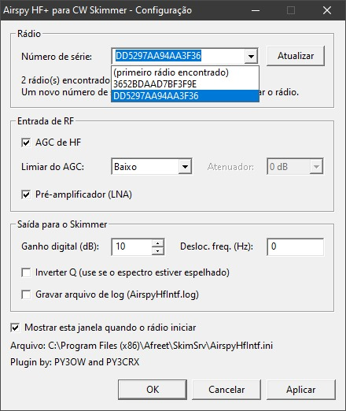

# Skimmer interface DLLs: Airspy HF+ and RTL-SDR

*English | [Português (Brasil)](README.pt-BR.md)*

Interface DLLs that let you use other SDR receivers with **CW Skimmer**, **Skimmer Server** and **RTTY Skimmer Server** (Afreet Software, VE3NEA):

| DLL | Radio | Documentation |
|---|---|---|
| `AirspyHfIntf.dll` | Airspy HF+ / HF+ Discovery | This page |
| `RtlSdrIntf.dll` | RTL-SDR, including the RTL-SDR Blog V3 and V4 | [README-RTLSDR.md](README-RTLSDR.md) |

**Just want to use it?** The compiled files are in the [`bin`](bin) folder. Copy the DLL for your radio to the Skimmer folder; nothing else needs to be installed.

The rest of this page is about the Airspy DLL.

> **Status:** `AirspyHfIntf.dll` is working with a real Airspy HF+ Discovery, as reported by the user. The bench figures below come from a test with a simulated radio.

## Contents

| File | Description |
|---|---|
| `bin/AirspyHfIntf.dll` | Compiled DLL, 32-bit, ready to use |
| `bin/AirspyHfIntfConfig.exe` | Optional: the same settings window as a standalone program |
| `bin/RtlSdrIntf.dll`, `bin/RtlSdrIntfConfig.exe` | The same two files for the RTL-SDR |
| `AirspyHfIntf.c` | DLL source code (C, single file) |
| `config/` | Source code of the settings window (shared by the DLL and the standalone program) |
| `AirspyHfIntf.ini` | Settings file (optional) |
| `test/mock_airspyhf.c` | Fake `airspyhf.dll` that generates a 10 kHz tone |
| `test/host.c` | Test program that plays the role of the Skimmer |
| `build.sh` | Build script |
| `third_party/` | libairspyhf and libusb, downloaded by `build.sh` (not in the repository) |
| `LEIAME.txt` | Short instructions in plain text (Portuguese) |
| `README.pt-BR.md` | This documentation in Brazilian Portuguese |
| `RtlSdrIntf.c`, `RtlSdrIntf.ini`, `rtlsdr/`, `test/mock_rtlsdr.c` | The RTL-SDR DLL, described in [README-RTLSDR.md](README-RTLSDR.md) |

## Installation

### Dependencies

None. The radio library (libairspyhf) and libusb are built into the DLL, which is still 32-bit because the Skimmer is a 32-bit program. There is no need to copy `airspyhf.dll` or `libusb-1.0.dll`.

The radio must be using the WinUSB driver, which Windows 10/11 installs automatically for the HF+ Discovery.

### Skimmer Server and RTTY Skimmer Server

1. Copy `AirspyHfIntf.dll` (and optionally `AirspyHfIntf.ini`) to the program folder (`SkimSrv` or `RttySkimServ`). No renaming is needed: the program loads the DLLs it finds there. RTTY Skimmer Server uses the same DLL interface, but has not been tested with this DLL.
2. The radio shows up in the list as **Airspy HF+**.
3. One receiver only, that is, one band per radio.

### CW Skimmer

1. Copy the same DLL to the CW Skimmer folder under the name **`Qs1rIntf.dll`** (keep the original one, if present).
2. Under *Settings > Radio*, choose **QS1R**.
3. The `.ini` is still named `AirspyHfIntf.ini`.

This procedure is unconfirmed: there are signs that CW Skimmer 2.1 talks to the QS1R directly over USB ("Unable to load libusb0.dll" error) and does not load this DLL. Skimmer Server loads the DLL normally.

The radio can only be opened by one program at a time (close SDR# first).

## Settings

Settings live in `AirspyHfIntf.ini`, next to the DLL. The settings window writes to that file, and you can also edit it by hand. Either way, the DLL notices the change and applies it while the Skimmer is receiving; only a new serial number waits for the next time the radio is started.

### Settings window



The window is built into the DLL and opens by itself when the Skimmer starts the radio. It runs in its own thread, so the Skimmer keeps working while it is open. Untick **Show this window when the radio starts** (or set `ShowWindow=0`) if you do not want it to appear.

- **Serial number:** lists the radios found, so you can pick one when you have more than one. You can also type the serial number.
- **Front end:** HF AGC, AGC threshold, attenuator (when AGC is off) and preamplifier.
- **Output to the Skimmer:** digital gain, frequency offset, Q inversion and log file.
- **Apply** saves without closing, so you can watch the effect on the waterfall.

The window is shown in Portuguese when Windows is in Portuguese, otherwise in English.

`AirspyHfIntfConfig.exe` opens the same window without the Skimmer, which is useful when the window was turned off or the configured radio cannot be opened. Copy it to the folder of the DLL. To edit a different file, pass its path on the command line: `AirspyHfIntfConfig.exe AirspyHfIntf_2.ini`. If the folder is under `Program Files`, it offers to restart as administrator, which that folder requires for saving.

### More than one radio

Make a copy of the DLL with another name ending in `Intf.dll`, for example `AirspyHfIntf_2.dll`, and create an `.ini` with the same name (`AirspyHfIntf_2.ini`) holding the other radio's serial number. A DLL uses the `.ini` that has its own name and falls back to `AirspyHfIntf.ini` when that file does not exist. When a serial number is set, the radio name shown by the Skimmer ends with its last 8 digits.

### Keys in the `.ini`

| Key | Default | Purpose |
|---|---|---|
| `HfAgc` | 1 | The radio's HF AGC. With AGC on, `HfAtt` is ignored |
| `HfAgcThreshold` | 0 | AGC threshold: 0 = low, 1 = high |
| `HfAtt` | 0 | Manual attenuator, 0 to 8 (6 dB steps) |
| `HfLna` | 0 | Preamplifier |
| `GainDb` | 0 | Digital gain in dB applied to the samples delivered to the Skimmer |
| `InvertQ` | 0 | Set to 1 if the spectrum appears mirrored |
| `FreqOffsetHz` | 0 | Added to the requested frequency (transverter/upconverter) |
| `Serial` | empty | Serial number in hexadecimal, to pick a specific radio |
| `ShowWindow` | 1 | 1 opens the settings window when the Skimmer starts the radio |
| `Log` | 0 | 1 writes `AirspyHfIntf.log` to the DLL's folder |

## How it works

### The Skimmer interface

The Skimmer loads the DLL and uses six exported functions (`stdcall`, undecorated names), defined by VE3NEA in the `SdrTypes` unit:

| Function | What this DLL does |
|---|---|
| `GetSdrInfo` | Returns the name "Airspy HF+", 1 receiver and the exact rates 48000/96000/192000 Hz |
| `StartRx` | Opens the radio, configures it and starts delivering I/Q |
| `StopRx` | Stops reception and closes the radio |
| `SetRxFrequency` | Tunes the center frequency (receiver 0 only) |
| `SetCtrlBits` | Nothing (required by the interface) |
| `ReadPort` | Returns 0 (required by the interface) |

In `StartRx` the Skimmer passes a structure with the desired rate (`RateID`: 0 = 48 kHz, 1 = 96 kHz, 2 = 192 kHz) and the callbacks. The DLL uses two of them:

- **`IqProc`**: called 93.75 times per second with an array of 8 pointers to blocks of complex `float` samples aligned to 16 bytes. Each block has rate / 93.75 samples: 512, 1024 or 2048.
- **`ErrorProc`**: called with a message when something fails.

### The sample path

1. libairspyhf (statically linked, together with libusb) opens the radio over USB.
2. The DLL picks the lowest radio rate that equals the requested rate times 2ⁿ. On the HF+ Discovery that is the native 192 kHz.
3. Each divide-by-2 goes through a 63-tap half-band FIR filter (Kaiser window, β = 8).
4. The radio's samples arrive as `float` ±1.0 and are multiplied by 2³¹, the same 32-bit integer scale that HermesIntf delivers to the Skimmer.
5. The 7 pointers for unused receivers point to a block of zeros.

### Robustness details

- `RateID` is masked with `0xFF`, because Skimmer Server 1.1+ sends garbage in the high bytes.
- `StopRx` closes the radio in a separate thread, so the Skimmer does not hang if the sample thread is inside `IqProc`.
- `SetRxFrequency` may arrive before or after `StartRx`; the frequency is stored and applied when the radio is opened.
- A small thread watches the `.ini` modification time and reapplies the settings when it changes.

## Simulated test results

| Rate | Blocks/s (expected 93.75) | Measured tone | Amplitude |
|---|---|---|---|
| 48 kHz | 93.98 | 10 000.0 Hz | as expected |
| 96 kHz | 93.89 | 10 000.0 Hz | as expected |
| 192 kHz | 93.70 | 10 000.0 Hz | as expected |

## Adjustments with the real radio

- **Mirrored spectrum:** if signals show up on the wrong side of the center frequency, use `InvertQ=1`.
- **Level:** if the waterfall is too weak or saturated, adjust `GainDb`.
- **Calibration:** the exact rates reported are the nominal ones; fine adjustment is done with the Skimmer's own frequency calibration.
- **If something fails:** set `Log=1` and check `AirspyHfIntf.log`.

## Building

With 32-bit MinGW, run `sh build.sh`. It downloads libairspyhf and the static libusb into `third_party/` and builds `AirspyHfIntf.dll` and `AirspyHfIntfConfig.exe` into `bin/`, each as a single file with no dependencies. It does the same for `RtlSdrIntf.dll` and `RtlSdrIntfConfig.exe`, using the RTL-SDR Blog driver. It needs `git`, `curl` and `7z`.

Without `-DSTATIC_AIRSPYHF`, the DLL is built in the variant that loads an external 32-bit `airspyhf.dll`; that is the variant used by the simulated test.

To rerun the simulated test:

```
i686-w64-mingw32-windres -I config config/settings.rc -O coff -o res.o
i686-w64-mingw32-gcc -O2 -msse2 -shared -static-libgcc -o Qs1rIntf.dll AirspyHfIntf.c config/settings_dialog.c res.o -lcomctl32 -Wl,--kill-at
i686-w64-mingw32-gcc -O2 -shared -o airspyhf.dll test/mock_airspyhf.c
i686-w64-mingw32-gcc -O2 -o host.exe test/host.c
host.exe
```

## Third-party code

The compiled files contain libusb, libairspyhf and the RTL-SDR Blog driver. Their licenses are listed in [THIRD-PARTY-NOTICES.md](THIRD-PARTY-NOTICES.md).

## Credits

Plugin by PY3OW and PY2PLL+PY3CRX.

## References

- Original interface: `SdrTypes` unit and messages from VE3NEA (2009-2010)
- [k3it/HermesIntf](https://github.com/k3it/HermesIntf): equivalent open-source DLL for HPSDR radios
- [airspy/airspyhf](https://github.com/airspy/airspyhf): Airspy HF+ library
- [rtlsdrblog/rtl-sdr-blog](https://github.com/rtlsdrblog/rtl-sdr-blog): RTL-SDR driver with V3 and V4 support
